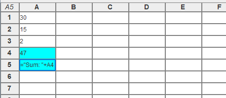

# Subsheet
A basic spreadsheet program written in the Java programming language.

### Features
- Loading and saving files
- Basic formatting for cells
- Cell formulas implemented with a custom built interpreter

## Formulas

Start a formula with an equals sign '=', then type an expression. Click outside the cell to see the expression evaluated automatically. Cells can be referenced by their letter and number. String literals can be written inside double quotes, and concatenated with the plus '+' operator. Cell ranges can be created with the '..' operator, ex. `A2..B7`. There are currently two functions, `sum` and `if` (case sensitive). `sum` takes in one argument, a range of cells, and returns their sum (ex. `sum(A2..B7)`). `if` takes in three arguments, a condition, true value, and false value. If the condition is true, it returns the true value, otherwise, it returns the false value (ex. `if(2 = 2, 5, 7)` returns 5).